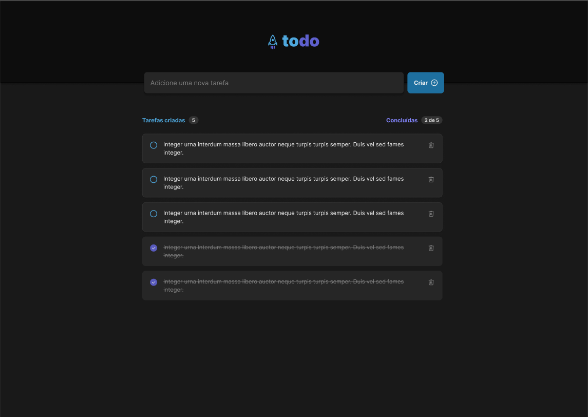

# 🧠 Desafio Técnico – Correção de Erros em Projeto ReactJS

Bem-vindo ao desafio!

Este repositório contém uma aplicação ReactJS propositalmente com erros de diversos tipos. O objetivo é simular um cenário realista de manutenção de código legado ou pressa na entrega, exigindo atenção, raciocínio lógico e domínio da stack.

### Abaixo está a imagem do projeto



---

## 🧪 Objetivo

Seu principal desafio é identificar e corrigir os erros existentes na aplicação, que estão distribuídos em diferentes níveis de gravidade — desde falhas críticas que impedem a execução até bugs sutis de layout e lógica.

Além da correção de erros, você terá liberdade para refatorar partes do código que considerar importantes, visando melhorar legibilidade, performance ou organização.

Você também poderá propor e desenvolver novas funcionalidades que julgar relevantes para a aplicação. Soluções criativas e demonstrações de proatividade serão valorizadas na avaliação final.

## Esse é um desafio técnico, mas também uma oportunidade de mostrar sua capacidade de raciocínio, iniciativa e atenção aos detalhes em um cenário realista de manutenção e evolução de software.

### ✅ Tipos de erros que você encontrará:

1. **Erros de build/start**

   - O projeto pode falhar ao ser iniciado com `yarn dev` ou `npm run dev`.

2. **Erros em tempo de execução**

   - A aplicação até roda, mas falha em ações como cliques, envio de formulário, atualizações de estado ou requisições.

3. **Erros visuais e de responsividade**

   - Elementos desalinhados, sobreposição em telas menores, falta de espaçamento, etc.

4. **Pegadinhas sutis**
   - Hooks mal utilizados.
   - Props trocadas.
   - Estados que não refletem corretamente a UI.
   - Componentes que não atualizam como deveriam.

---

## 🔧 Como rodar o projeto

```bash
# 1. Instale as dependências
yarn install

# 2. Rode o projeto em modo desenvolvimento
yarn dev
```

> ⚠️ Se você tiver problemas com `yarn`, utilize `npm` como alternativa.

---

## ⏱ Tempo estimado

Recomenda-se um tempo de até **3 horas** para resolução completa.

---

## 📝 O que será avaliado

- Capacidade de identificar e corrigir bugs de forma eficiente.
- Clareza e organização das correções no código.
- Atenção a detalhes de layout e comportamento da UI.
- Uso correto de hooks e props.
- Código limpo e boas práticas.

---

## 📤 Entrega

Ao finalizar o desafio, você pode:

- Subir o projeto corrigido em um repositório público do GitHub e enviar o link.
- Ou compactar a pasta do projeto e enviar o `.zip`.

---

## 💡 Dicas finais

- Use o console do navegador para identificar erros silenciosos.
- Valide o comportamento esperado da aplicação nas interações.
- Releia o código com atenção — algumas falhas são sutis.
- Preze por clareza: escreva como se outra pessoa fosse dar manutenção depois de você. 😉

Boa sorte e divirta-se! 🚀
